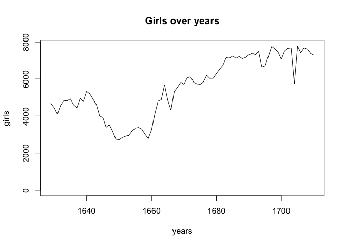
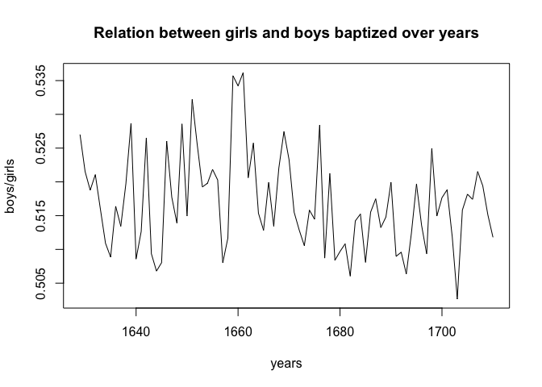
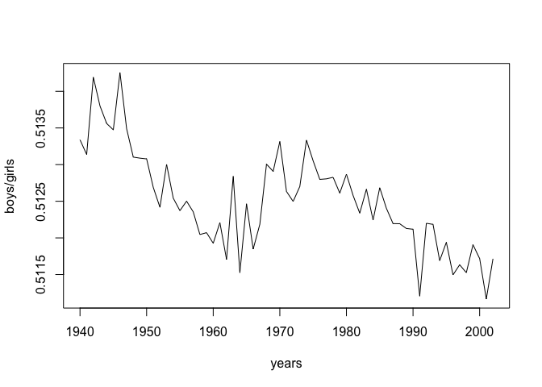

Lesson commands over arbuthon data
----------------------------------

Connect external data source

    source("http://www.openintro.org/stat/data/arbuthnot.R")

------------------------------------------------------------------------

Check dataset sizes, and names

    dim(arbuthnot)

    ## [1] 82  3

    names(arbuthnot)

    ## [1] "year"  "boys"  "girls"

------------------------------------------------------------------------

<!-- -->

------------------------------------------------------------------------

<!-- -->

Data analys over actual newborn data
------------------------------------

Dimensions, names, and min/max years of present data set

    dim(present)

    ## [1] 63  3

    names(present)

    ## [1] "year"  "boys"  "girls"

    c(min(present$year), max(present$year))

    ## [1] 1940 2002

------------------------------------------------------------------------

Are the present data and arbuthon on the same scale? How many times they
are differ (1 - mean equal)

    mean(present$girls + present$boys) / mean(arbuthnot$girls + arbuthnot$boys)

    ## [1] 321.5869

------------------------------------------------------------------------

Plot over relation between girls and boys borned in present years. As we
can see on the plot boys born have tend to decrease from 1940 and then
after 1975
<!-- -->

------------------------------------------------------------------------

In what year did we see the most total number of births in the U.S.?

    present$year[which.max(present$boys + present$girls)]

    ## [1] 1961
